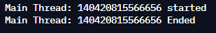
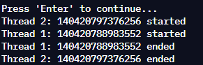

# Primer Portfolio
# a description and review of the problem and outline of your general approach and any main issues
identified within
## Section 1 - Primer Challenges
### Primer 1 - Fahrenheit / Centigrade Conversion
This first challenge required us to capture user input for subsequent two values. The first was the value entered represented a temperature value and the second represented the unit of temperature it was to be converted to. 

For the initial design, it was assumed that conversion was only between Fahrenheit and Centigrade and algorithms needed to be designed to suit these conversions. 

In addition, robust input handling would be required in order to ensure the data entered for each value was in the correct format, so that the variables within the program can used to manipulate the data appropriately.

After review and careful consideration, the challenge itself could be broken down into these main tasks:
* Get data from the user
* Verify the data is in a suitable format
* Create a method to convert F->C
* Create a method to convert C->F
 
**Reflection (as well as issues, challenges & resolutions)**

On a surface level, the implementation of the initial design was not particularly difficult. However, I found the biggest challenge of this primer to be designing and implementing a robust enough input handling system to deal with the back-to-back user inputs. During experimentation with various input handling methods, I found that there were wider issues with my design that needed to be refactored. 

For example, there were issues with my control flow structures such as specific loops and conditional statements, that appeared unintentionally as the result of bad input, which either caused incorrect output to appear, or would not take input upon looping back around. Sometimes, due the conditions set for these loops and statements, some output would not appear at all. This required me to refactor the conditions for some of my loops to ensure they were working correctly.  

I opted to use the stringstream type and library when capturing user input and placing the values in their respective variables (such as int, float etc). This is because this method is a safe option that will produce and store a default value (usually 0 or 0.0) in the respective variable when using the << operator if conversion is not possible. This can be then handled appropriately when this default output is expected. 

My most reliable method of input validation was using the string::find_first_not_of() function, to search for any input beyond what was expected. This was especially useful for types other than strings.

I expanded upon the initial design of the primer to include conversion to and from Kelvin for both Fahrenheit and Celsius. 
To do this: I had to handle four extra input possibilities that each belonged to a respective conversion these were: 
“FK” and “CK” for conversion from Fahrenheit and Celsius to Kelvin and “KF” and “KC” for Kelvin to Fahrenheit and Celsius respectively. 

This necessitated the creation of two further functions for conversion to and from Kelvin. Depending on the user’s input with the above codes (and providing the input is valid), these functions are passed the user’s input string as a parameter, and perform the respective conversion to or from Kelvin using Celsius or Fahrenheit based on the first letter of the string when converting to Kelvin, or the second when converting from Kelvin. If the input is invalid, an error message appears. The process flow was reworked with the other conversion codes and methods, so the user can convert between the three temperature units in the same way as the initial design, with no subsequent input required. The user can also type “quit” at any time to exit the program.

### Primer 2 – Self-service checkout
The second primer also involved collecting two user inputs, this time repeatedly inside a loop to add to a running total under the umbrella of a “self-service checkout” system. The first value captured represented the quantity of the item and the second represented its price. Various output displays asking for each value and visually tracking the number of items entered were also included throughout. 

The two values (quantity and price) were then multiplied and added to a running subtotal. Once the user had entered all of their items, they can enter 0 when inputting quantity to conclude the “transaction” and display the total price of all of their items. The subtotal value was combined with a “shopping tax” modifier, stored as a constant value, to calculate a total price.

Because of the very specific flow of this program, and the conditions that control it, the task itself was quite easy to break down as follows:

While input is not <= 0:
* Get data from the user
* Validate input data, ensuring it is in the right format
  * If not, display appropriate error messages
* Calculate cost 
* add to subtotal

Then:
* Calculate tax
* Combine subtotal and tax to get total price for transaction

**Reflection (as well as issues, challenges & resolutions)**

For the initial design, the greatest challenge I faced was ensuring that the output strings displayed to the user would appear in the right order and with the correct spacing. This also challenged me when I came back to refactor my program to include extra functionality and input validation, as extra error messages needed to be displayed alongside existing text. 
Input validation also proved a challenge for this primer as I struggled to identify issues with my control flow structures when attempting to re-capture input from the user after rejecting their input and displaying an error message. 

For this primer’s additional functionality, I included the option to remove the most recently added item from the subtotal. This is done by entering “r” or “R” when prompted. To facilitate this, I used a vector object to store all the previous prices, which is added to just before the cost of an item is added to the subtotal. When removing an item, the element at the back of the previousPrices vector is taken away from the subtotal, and that element is “popped” from the back of the vector. An output message appears confirming this, and the total amount of items is decremented. 

I also refactored my code at this stage to separate calculating the total and checking if the input for price entry is valid from the main function into their own respective functions. The validity of a price input is tracked using the validPrice Boolean which assigned a value from the checkPrice function.  

### Primer 3 – Password Complexity Checker
The third primer takes a user input and returns an output evaluating the strength of the input string as a password, according to specified criteria. These are :
* A password is weak if it only has solely either numeric or alphabetic characters 
* A password is moderate if it has at least 4 characters and does not meet the criteria of the other strength classifications
* A password is Strong if it has 8 or more characters, at least two of which must be numeric and 4 or more of which must be alphabetic
* A password is Very Strong if it meets the criteria of a strong password, with at least one special character also included.

It was also specified that the password evaluation itself must take place in a separate function and returns a score from 1-4 to represent each of the password strength classifications in ascending order. 

Each of the password strength criteria provided a good starting point for dissecting the problem, as four key conditions were already outlined in the brief and a number of different tasks became apparent the more each condition was evaluated. I broke the program down as such:
* Capture user input
* Create a function to check against the criteria and calculate a strength score
* Create a function to count each type of character in the string (one for each of letters, numbers and special characters)
* Assign the returned strength score to an output that reflects the strength of the password

**Reflection (as well as issues, challenges & resolutions)**

Since many of the conditions were already laid out in the brief for this primer, and since we did not need to specifically validate user input and could just take the string at face value, I had less issues with this task than others. 

Where this task proved challenging was meeting the criteria of the “Weak” and “Moderate” password strengths. As I mentioned above, a function needed to be created to count each type of character in the user-supplied password string. This was used for the “Weak” password strength conditions.

This meant storing 3 separate values to track each type, and using the created function to loop through the string with an iterator to check against each character to see if they fall within a range of ASCII character codes. An iterator was used as it’s a more direct method that can make use of string class member functions to accurately loop through each character index of a string, without having to track integer index variable, and the ASCII codes were used as they provide ranges between multiple values that correspond to each character type, opposed to checking against each letter, number or special character individually.

For the “Moderate” strength, since it acts as a “default” case of sorts, it needed to be placed at the end of the control logic flow, which was a realisation made after testing the program extensively.

This primer’s additional functionality includes a default case when assigning password strengths after returning the score from the function, before displaying the evaluation string. Because of the tightly constructed cases for the other password strengths, this case can only occur if the password length is less than 3 characters. A corresponding input string is also added in this case to encourage the user to input a character with more than 3 characters. In addition, the “Weak” password type will also be assigned to passwords that include only special characters, similar to that of the existing cases for both numbers and letters. 

### Primer 4 – Employee List Removal
The fourth primer’s initial design was to display a pre-defined array of employees and take a user input. If the input matched one of the names in the array, that name is removed. 

The only input handling required for this primer is to check if the name supplied by the user input exists, and to display an error message if not.

There was also a second output string that displayed the current number of people in the list.

I broke down this problem in the following way:
* Populate name array
* Display number of employees
* Display employee list
* Capture user input
* Create a function that searches for the user supplied name
  *  remove if found
  * display “Employee not found” if not

**Reflection (as well as issues, challenges & resolutions)**

For this primer, I had significant difficulty using arrays to create an effective and simple solution. Arrays in C++ are immutable in size and require that size to be defined on creation. 

For the sake of this task, especially with the pre-defined data to include, arrays, as a data structure, would have been sufficient. However, in order to support the functionality required for this primer, I would have had to create a number of additional functions and kept track of the array size manually, which can be cumbersome,in addition to the flow above. 

In order to continue to create with simplicity in mind, to conserve system resources and to support my additional functionality for this task, I instead opted to use a vector as my data structure. This is because of several factors: 
* its size is variable 
* elements can be fully removed, not just changed or hidden, and the vector will change sizes accordingly
* there are a number of member functions and extended classes (such as iterators) part of the vector class that are well suited to this task

Because vectors have access to such a useful suite of functionality, especially when compared to arrays, I also made use of the “find” function from the algorithm library in tandem with the "erase" function built into the vector object to search for and erase a found employee. This is a significantly more optimised and simple solution to the problems posed by the primer, compared to a solution that using solely arrays would have required. 

My additional functionality for this primer was the inclusion of an addNewEmployee function that, if the user inputs “+1”, prompts them to enter a name that is added to the vector. This function also adds additional input validation, ensuring that a string equal to “+1” cannot be added, since inputting that specific string as part of the initial design’s removal prompt will instead call the addNewEmployee function, effectively adding an element that cannot be deleted.

### Primer 5 – Phone Directory
The 5th Primer reads data from a file to be stored in the program. Each entry has two associated pieces of data, a name and telephone number. The initial design of the program is to capture user input to search for the entries and output both pieces of data if found, and an error message if not.

I broke down the program thusly into the following tasks:
* Read data from file
* Separate data entry from single string into two 
* Store in data structure 
* Capture user input
* Create function to search for data entry based on user input

**Reflection (as well as issues, challenges & resolutions)**

For this primer, I initially had trouble finding a reliable way of splitting the single string taken from the input file into two. The format of the file was CSV, so each name and telephone number pair were separated by a comma. I spent a significant amount of time developing a solution to split each line of text from the file at the comma delimiter, even delegating the task to its own function. This function would have been used for both primer 5 and primer 6, but in the end, I opted to use the getline function’s compatibility with the stringstream type to loop through each line from the file and separate the each time a specified delimiter, in this case a comma, was found. This was in the interests of simplicity and conserving system resources. 

Because the functionality of this primer requires searching for specific strings (or slight variations thereof, such as capitalised letters), I included the removeLeadTrailSpaces function to remove any instances of whitespace (including tabs, carriage returns, etc) from the beginning or end of a string read from the input file. This was implemented to aid the search functionality, as users would likely not be aware of any leading or trailing whitespace at the beginning of the string. Any spaces within the string itself before the last character remain unaffected. 

I once again used vectors as my chosen data structure, as we cannot be sure of the amount of data that comes from a given file. Instead of opting for 2-dimensional arrays to store the data from the file, I defined a structure to group both pieces of data under a single type: details. My vector was then made up of elements of the details type and I updated and accessed each variable in the structure individually, but was able to pass both elements as one variable. This was chosen for readability, and ease of use. 

I also included a check when opening the input file to extract data to ensure that the file requested exists in the active directory.

### Primer 6 – Data file parser
The objective of the initial design of this primer was to once again read data from a file, this time parsing and formatting the data for suitable output strings. Each of the three comma separated values needed to be formatted differently and displayed in “columns” of equal size, based on the longest item for that set of inputs.  

Similar to the task above, I needed to select appropriate data structures to store the incoming information from the input file, and once again opted to use vectors for their variable size and structures to store multiple variables under a single type object. This structure was named salaryIndicies.

I also broke the challenge down into the following tasks:
* Read data from file

While each line from the file is being read:

* Create a function that calculates the max field width based on input sizes.
* Remove any trailing or leading spaces
* Push each element separated by a comma to a string vector
* Initialise a salaryIndicies object with the data from the string and push to the back of the main vector

Then:

* Create a function that:
  *  Suitably formats each column used for the output string 
  * Suitably formats each member variable element from the salaryIndicies structure for the output string

**Reflection (as well as issues, challenges & resolutions)**

The challenges and issues I faced while developing this primer were all concerning formatting the output strings. Prior to the development of my removeLeadTrailSpaces function, which was used to assist with parsing the input strings for both primers, I had difficulty in getting the output strings to line up correctly if any leading or trailing spaces were present. Even with this problem resolved, thanks to the function, I still had issues getting the output string to line up correctly. 

Thankfully, after doing some research, I found the utilities of “setw” from the iomanip library and “left” from the iostream library especially useful for this purpose. However, I found that these member functions still required a significant learning curve in order to utilise them correctly. Once I’d overcome this hurdle, I refactored my code and placed any output operations into their own function, which I called from the main program. This was done to improve the readability of my code. 

I also continued to use the getline function’s overload with stringstream and delimiter parameters to separate values and store them in the salaryIndicies objects and subsequent vectors designated to store that defined type. 

The additional piece of functionality I added for this primer was the creation of a function that writes the formatted data to an output file, salaryList.txt. This contains the same output that is seen in the console. This needed to be formatted in the same way as the output string, and was also placed in its own function. Because these are two separate output streams (cout and the output file) and the data is identically formatted, much of the code is required to be similar for both of these functions.

### Primer 7 – Sleep timer
The 7th primer is designed to demonstrate an understanding of multithreading features and the functionality of the “thread” library. 

In particular, this primer focuses on the sleep_for function, which pauses execution of the program for a provided amount of time. The initial design was to capture user input for the amount of time that should be passed into the sleep_for function. If no valid input is provided, then the program will pause execution for a default 10 seconds. No output was expected for this task.

This problem did not require a significant amount of consideration or deconstruction, but was broken down as follows:
* Capture user input
* Check if user input is valid, or if there is any input at all
  * if yes, store the user’s input as the duration to use
  * if no, default to 10 seconds
* pause execution of the program for the amount of seconds specified

**Reflection (as well as issues, challenges & resolutions)**

Being a considerably smaller task compared to that of the other primers, I did not encounter any particular issues. The only aspect of this task that I had to contemplate was any input validation for the task itself. Since no output was expected, I was unsure whether to include an error message if any user input was invalid and whether or not to have the user be required to input again on a failed attempt. 

In the end, after refactoring my code, I opted to have the program default to 10 seconds for the sleep_for duration if invalid input, or a blank string is entered. 

I made use of the “chrono” library in order to provide a steady and accurate parameter for the this_thread::sleep_for function to use. The chrono library has member functions that can accurately represent a wide variety of time durations, ranging from nanoseconds to years. I felt this was a suitable inclusion due to the need to pause for a measurable amount of time. 

### Primer 8 – Joining and Detaching Threads

Primer 8 expands on concepts introduced in Primer 7, and was split into two parts. The initial design uses two global variables representing two durations that two different instances of the this_thread::sleep_for member function takes as parameters to pause execution for. These different instances were contained within their own functions to demonstrate multithreading functionality. 
Both of these functions were then defined as thread objects and relevant output within the functions tracks when each of these threads (including the thread in the main function for this primer) start and end. 

The two separate threads were then “joined” to the main thread, which prevents the main thread from executing fully until both joined threads terminated or completed.

The second part of this primer focussed on detaching threads, which necessitated the creation of a second function to act as another main thread. Two further threads were created, initialised using the same functions mentioned above and then were immediately detached, and executed them independently, which prevented them from blocking or synchronising with the main thread. The main thread then completes, releasing its resources and the two other threads completed independently. 

I broke down this problem like so:
PART A:
* Place output strings at the start and end of the main function
* Create first timer function
* Create second timer function
* Create thread objects for both functions
* Check if threads are joinable 
  * if so, join thread

PART B:
*Place output strings at the start and end of the new function
*Create thread object for first timer function
*Detach first thread object
*Create second thread object for second timer function
*Detach second thread object

**Reflection (as well as issues, challenges & resolutions)**

Similar to primer 7, the 8th primer I found was simple to execute, but took slightly longer to understand than others. It was not initially clear to me what the order of execution was for each of the thread object functions, especially when detaching threads for part B of the primer. 

The source of a considerable amount of confusion came when the two detached threads not only continued to output to the console after the main thread has terminated, but also seemingly executed out of order. An example of this can be seen below. 

 

My expectation for the behaviour of the detached threads differed to what actually occurred. I misunderstood what was meant by detached thread’s executions becoming independent of one another, and the behaviour of the threads continuing to execute without blocking one another. As such, the inclusion of the additional output led me to believe I had approached the task in the wrong way, since only the output from the main thread was required. 

This happens due to the fact that the console output won’t always reflect the state of the program’s order of execution because of a delay in transmitting output from the program itself to an output stream, such as the console.

Instead, since the execution of the detached threads were essentially asynchronous (aside from the use of the sleep_now function) by executing without reliance on or waiting for one another, there was in fact no reliable way to model or anticipate an expected output. Once I had overcome this obstacle, I refactored my code to give it an extra level of readability.

..  
..  

---
## Section 2 - Programming Paradigms
### Programming Paradigms
Simply put, a programming paradigm, for example, procedural, object-oriented, functional, structured, declarative, imperative and event driven can be described as a specific approach used when trying to solve a problem.  Although many programming languages can (and do) support multiple paradigms this discussion will focus more specifically on the possible benefits with examples of the potential differences and similarities of five from the above list. These are ...

---
## Section 3 - Continued Professional Development
### Benefits of becoming a Polyglot Programmer
Vestibulum vitae semper sem. Duis leo leo, suscipit at felis non, pellentesque varius massa. Sed sit amet orci nibh. Morbi scelerisque faucibus elit, vitae mollis turpis finibus eget. In convallis euismod nunc non imperdiet. Duis ultricies pulvinar lorem, sed molestie nunc porta at. Aenean arcu ante, efficitur nec felis sed, feugiat iaculis turpis. Vestibulum eu elementum diam. Quisque nec tortor auctor, scelerisque ante vitae, fringilla tellus.

Quisque ligula lectus, efficitur quis malesuada sit amet, malesuada sed nibh. In lorem erat, elementum quis tempus nec, rhoncus ac ante. Mauris suscipit massa tempor, pulvinar neque vel, gravida nulla. Donec massa diam, molestie in diam nec, vulputate faucibus ligula. Aliquam erat volutpat. Aliquam sit amet dui ligula. Nullam euismod eros ultrices magna convallis lobortis. Proin convallis placerat tincidunt. Quisque interdum, nisi id egestas luctus, augue libero lacinia urna, sit amet tempus nisl sem nec quam. Vestibulum interdum urna mauris, vel dignissim nisi dignissim egestas. Donec volutpat dictum dui, at egestas sem tristique nec.
